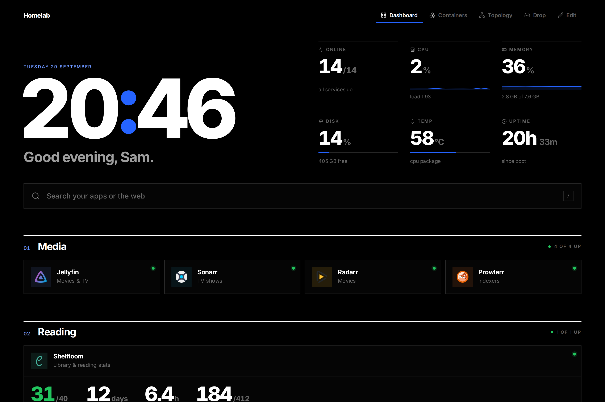
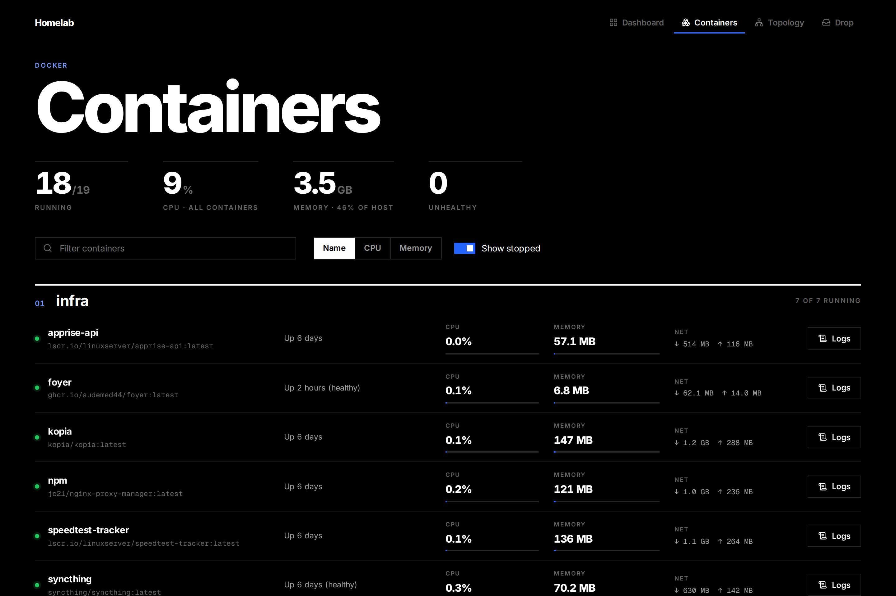
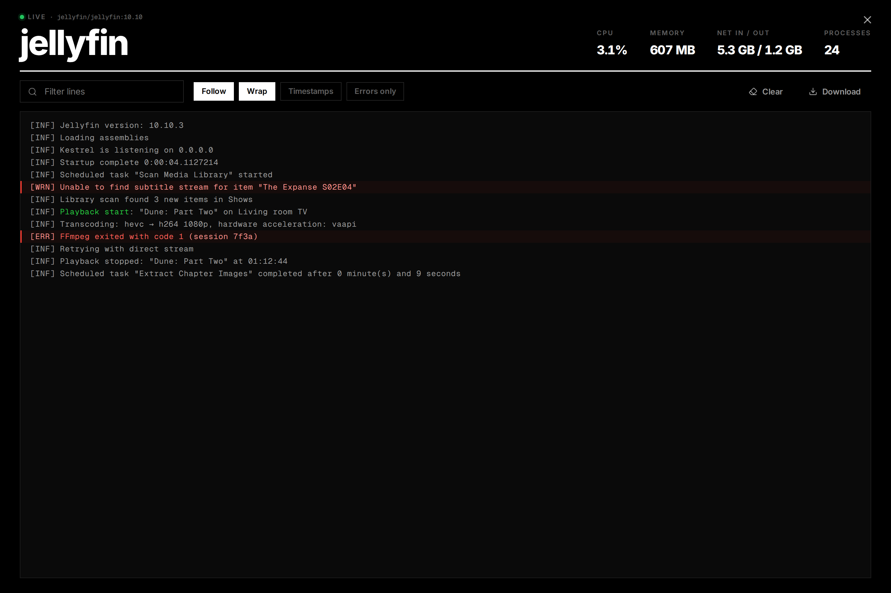
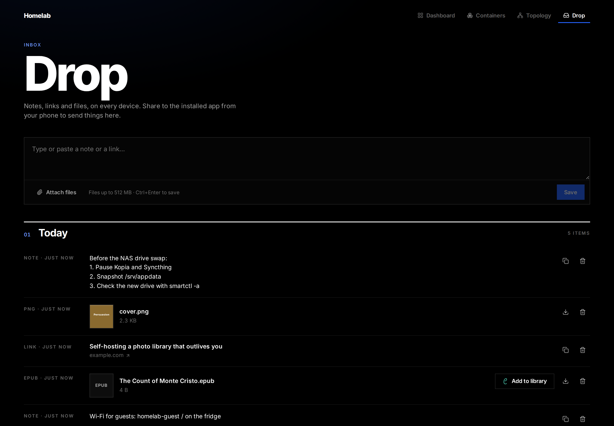
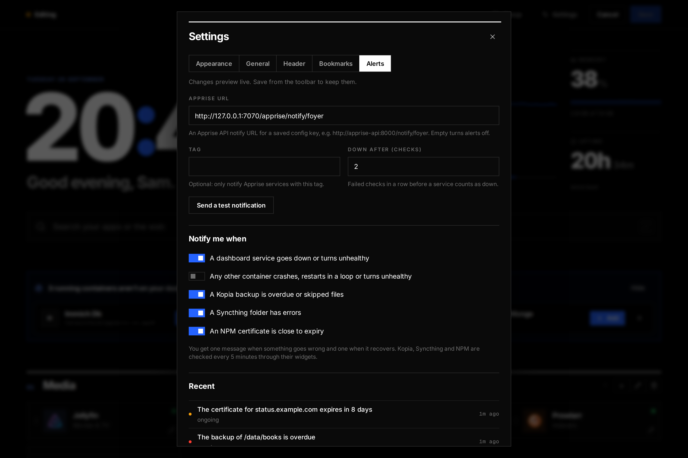
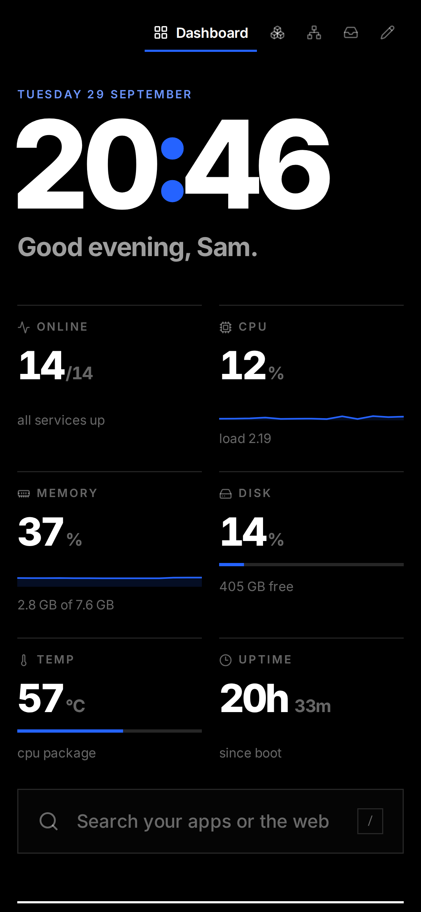

# Foyer

A small, good-looking start page for your homelab. It's a lighter
replacement for [Homepage](https://gethomepage.dev): one static Go binary
serving a Preact frontend, **~7 MB of RAM** at idle, in a 20 MB image.



- **Services** in numbered groups, with live up/down checks, Docker
  container state and memory use; one search box for your apps and the web
- **Host stats**: CPU and memory sparklines, disks, temperature, uptime
- **Widgets** for Kopia, Syncthing, Nginx Proxy Manager, Komodo, Uptime
  Kuma, Speedtest Tracker and iCal calendars, plus app widgets: any app can
  describe its own card ([Shelfloom](https://github.com/audemed44/shelfloom) does)
- **Containers and live logs**: every container with CPU, memory and
  network, and a log viewer that replaces Dozzle
- **Topology**: a map from each domain to its container to the folders it
  stores data in, showing what's backed up and what isn't
- **Alerts** through Apprise when a service goes down, a backup is overdue,
  a sync breaks or a certificate is about to expire
- **Drop**: a shared inbox for notes, links and files; install Foyer on
  your phone and share things to it
- **Edit in the browser** or in `foyer.yaml`; containers not on the
  dashboard are suggested with everything filled in; imports a Homepage
  config

## A look around

| | |
|---|---|
|  |  |
|  |  |
|  |  |

**Topology**: hover anything to follow it from domain to disk.


**Containers and logs**

| | |
|---|---|
|  |  |

**Drop, alerts, and on a phone**

| | | |
|---|---|---|
|  |  |  |

## Run it

```yaml
services:
  foyer:
    image: ghcr.io/audemed44/foyer:latest
    restart: unless-stopped
    user: "1000:1000"
    group_add: ["111"]          # the docker group id, to read container state
    extra_hosts: ["host.docker.internal:host-gateway"]
    environment:
      - TZ=Europe/London
    volumes:
      - ./foyer:/config
      - /var/run/docker.sock:/var/run/docker.sock:ro
    ports:
      - "3030:8080"
```

Open the page and click **Edit** to start customising.

Foyer has **no login**: anyone who can reach it can edit the dashboard and
read container logs. Run it on a private network, behind a VPN, or behind a
reverse proxy that handles authentication.

## Documentation

- [Installing](docs/install.md): compose, HTTPS and the installable app,
  environment variables, moving from Homepage
- [The dashboard](docs/dashboard.md): services, status checks, editing,
  themes, discovery and container labels, the `foyer.yaml` reference
- [Widgets](docs/widgets.md): every widget's settings, and how to create
  read-only credentials for them
- [The Foyer widget format](docs/app-widgets.md): give your own app a card
- [Containers and logs](docs/containers.md)
- [Topology](docs/topology.md)
- [Drop](docs/drop.md)
- [Alerts](docs/alerts.md)

## Development

```sh
cd frontend && npm install && npm run dev   # Vite on :5173, proxies /api to :8080
go run ./cmd/foyer                          # needs FOYER_CONFIG_DIR=./.data
```

`npm run build` writes to `web/dist`, which is embedded into the binary.
See `AGENTS.md` for the checks CI runs.
