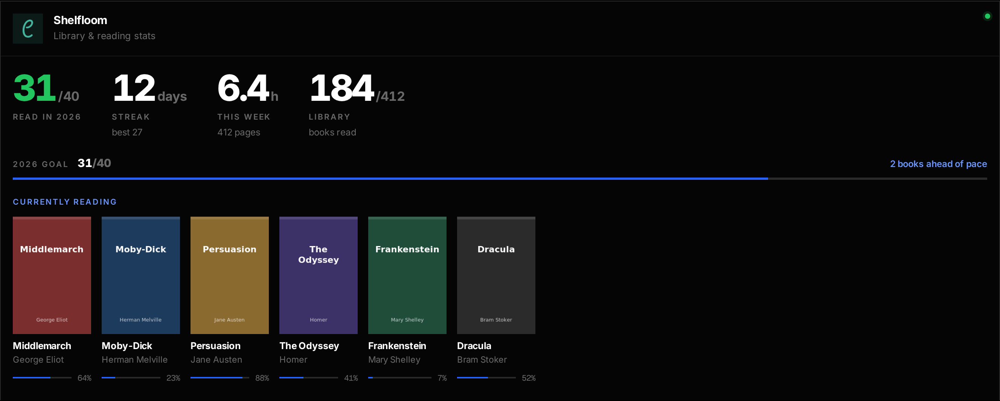

# The Foyer widget format

Apps can serve their own widget, and Foyer renders it in the same style as
the built-in ones. [Shelfloom](https://github.com/audemed44/shelfloom) does:
books read this year against a goal, streak, reading time, and the books
you're reading as a shelf of covers.



Add it as an `app` widget pointing at the endpoint:

```yaml
      - name: Shelfloom
        url: https://books.example.com
        widget:
          type: app
          url: http://shelfloom:8000/api/foyer/widget
          key: ${SHELFLOOM_TOKEN}   # optional, sent as a bearer token
```

Serving it at `/api/foyer/widget` lets Foyer find it by itself: in edit mode
it probes the apps on your dashboard, and new containers, and offers to add
the widget.

## Version 1

Every section is optional:

```json
{
  "version": 1,
  "stats": [
    { "label": "Read in 2026", "value": "31", "unit": "/40", "caption": "books", "tone": "good" }
  ],
  "progress": [
    { "label": "2026 goal", "value": 31, "max": 40, "caption": "2 books ahead of pace" }
  ],
  "items_title": "Currently reading",
  "items_layout": "covers",
  "items": [
    {
      "title": "Middlemarch",
      "subtitle": "George Eliot",
      "image": "/api/books/42/cover",
      "url": "/books/42",
      "progress": 64,
      "caption": "64%",
      "action": { "label": "Deploy", "url": "/api/foyer/deploy/main-stack", "confirm": "Deploy main-stack?" }
    }
  ],
  "accepts": { "url": "/api/foyer/upload", "types": [".epub", ".pdf"], "label": "Add to library" }
}
```

- `stats`: up to 6 big figures. `tone` is `good`, `warn`, `bad` or `accent`.
- `progress`: up to 4 labelled bars.
- `items`: up to 12, shown as a row of 2:3 `covers` or a compact `list`.
  `progress` is 0–100.
- `image` paths starting with `/` are fetched from the app by Foyer and
  passed on to the browser, so the app's internal address stays private
  (same-origin paths only; SVG isn't passed on). Public `https://` images
  are used directly.
- `url` paths starting with `/` resolve against the service's link, so they
  open the app's public page.
- Text is clipped to sensible lengths, so a misbehaving app can't break the
  card.

## Actions

An item can carry a button (`action`): [Hoist](https://github.com/audemed44/hoist)
puts **Deploy** on each stack.

- Clicking it shows `confirm`, when there is one, then Foyer POSTs `{}` to
  `url` on the app's own address (taken from the widget URL), with the
  widget's `key` as a bearer token. Only actions the widget lists can be
  run, and `url` must be a path.
- The app answers with a message, and optionally a link and a status to
  follow:

  ```json
  { "message": "Deploying main-stack…", "url": "/jobs/42", "status_url": "/api/foyer/jobs/42" }
  ```

- While there's a `status_url`, Foyer polls it (GET, same key) every few
  seconds until it answers a `state` other than `running`:

  ```json
  { "state": "done", "message": "main-stack: Recreated foyer", "url": "/jobs/42" }
  ```

  `state` is `running`, `done` or `failed`. Polling survives Foyer or the
  app restarting midway, so a deploy that recreates Foyer itself still
  reports back.
- When the action ends, the card reloads to show what changed. `url`
  resolves against the service's link, like item URLs.

## Taking files from Drop

`accepts` offers the app as a destination for files in [Drop](drop.md):
matching files get a button (its `label`, or "Send to *app*").

- `types` are extensions (`.epub`) or MIME types (`application/pdf`,
  `image/*`).
- Foyer POSTs the file as multipart form data, in the field `field`
  (default `file`), to `url` on the app's own address (taken from the widget
  URL), with the widget's `key` as a bearer token if one is set.
- The app may answer with a message and a link to what it made:

  ```json
  { "message": "Added “Middlemarch” by George Eliot", "url": "/books/42" }
  ```

  Drop shows the message with an **Open** button; `url` resolves against the
  service's link like item URLs.
- An error answer's `detail`, `error` or `message` is shown to the user.
