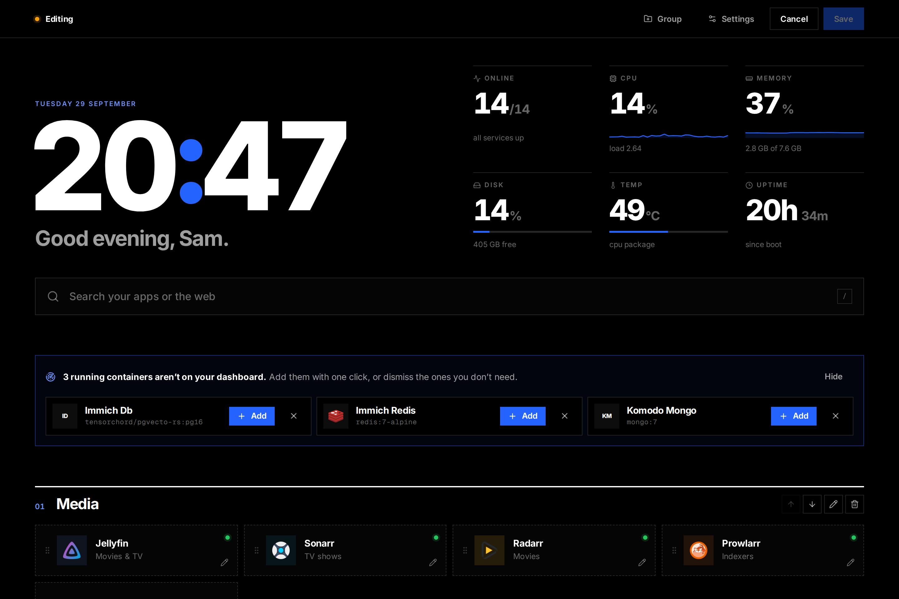
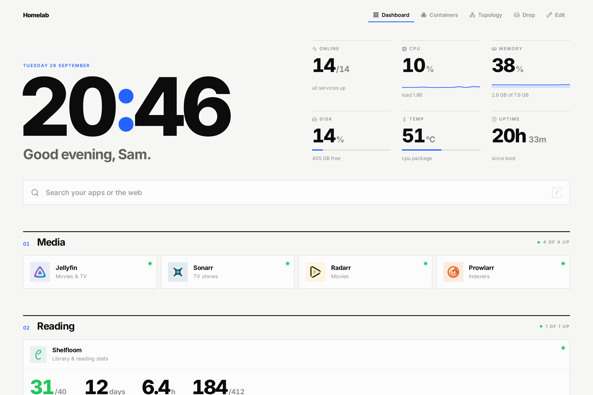

# The dashboard


The dashboard is a clock and greeting, host stats, a search box, your
services in numbered groups, and bookmarks. Everything can be changed from
the browser (click **Edit**) or in `/config/foyer.yaml`; hand edits apply
without a restart.

## Services

Each service is a card with an icon, a link and, optionally, a live
[widget](widgets.md). Its status dot comes from:

- **`ping`**, a URL Foyer checks from the server every `ping_interval`
  seconds. Any answer below 500 counts as up, redirects included. Use the
  address the Foyer container can reach (`http://jellyfin:8096`).
- **`container`**, a Docker container name: stopped, restarting and
  unhealthy containers show up on the card. A service whose `ping` points at
  a container (`http://sonarr:8989` → `sonarr`) is linked to it
  automatically.

Linked cards show memory use on hover and a button that opens the
container's [logs](containers.md#logs).

**Icons** can be a [dashboard-icons](https://github.com/homarr-labs/dashboard-icons)
name (`sonarr.png`, `jellyfin.svg`), a Simple Icons slug (`si-github`), a
URL, or `/icons/name.png` for a file in `/config/icons`.

## Search

Type to filter your services and press Enter to open the first match; with
no match, Enter searches the web. Press `/` anywhere to focus it.

## Editing



In edit mode you can drag services between groups, add and rename groups,
and open **Settings** for the theme (dark, light or system; accent colour;
Swiss, editorial or mono type; outline, filled or glass cards; density;
background image; custom CSS), the header, bookmarks and [alerts](alerts.md).
Changes preview live and are written on **Save**; the previous file is kept
as `foyer.yaml.bak`.



## Discovery

In edit mode, running containers that nothing on the dashboard points at are
offered as new services, with name, icon, status check and link filled in:

- **The link** comes from the [Nginx Proxy Manager](widgets.md#nginx-proxy-manager)
  host that forwards to the container, when there's an NPM widget. Otherwise
  it's guessed from the domain your other services share
  (`https://<name>.example.com`).
- **The name** comes from the compose service, the **icon** from the image,
  and the **status check** from the exposed port.
- Apps that serve the [Foyer widget format](app-widgets.md) are offered with
  their widget.

Labels on the container refine the suggestion; Homepage's labels work too:

| Label | Homepage equivalent | |
|---|---|---|
| `foyer.name` | `homepage.name` | Display name |
| `foyer.group` | `homepage.group` | Group to add it to |
| `foyer.icon` | `homepage.icon` | Icon |
| `foyer.url` | `homepage.href` | Link |
| `foyer.description` | `homepage.description` | |
| `foyer.ping` | `homepage.siteMonitor` | Status check |
| `foyer.hide=true` | | Never suggest this container |

Dismissed suggestions are stored under `ignored_containers`.

## On a phone


## `foyer.yaml`

Every key is optional; the editor writes the full file.

```yaml
title: Home
open_in_new_tab: true
ping_interval: 30            # seconds between status checks

theme:
  mode: dark                 # dark | light | auto
  accent: "#2563ff"
  font: sans                 # sans (Inter) | mono | serif
  cards: outline             # outline | filled | glass
  density: comfortable       # comfortable | compact
  columns: 4                 # max columns on wide screens
  background: /images/bg.jpg # URL or a file in /config/images
  background_dim: 0.75
  background_blur: 0
  custom_css: ""

header:
  greeting: true
  name: Sam
  clock: true
  clock_24h: true
  search:
    enabled: true
    provider: google         # google | duckduckgo | bing | kagi | custom
    url: ""                  # for custom: the query is appended
  system:
    enabled: true
    cpu: true
    memory: true
    temperature: true
    uptime: true
    disks: [/]               # paths inside the container; mount host drives read-only

groups:
  - name: Media
    columns: 2               # optional; by default a group sizes to its services
    collapsed: false
    services:
      - name: Jellyfin
        url: https://jellyfin.example.com
        description: Movies & TV
        icon: jellyfin.svg
        ping: http://jellyfin:8096
        container: jellyfin

      - name: Speedtest
        url: https://speed.example.com
        icon: speedtest-tracker.png
        widget:
          type: speedtest
          url: http://speedtest-tracker:80
          key: ${SPEEDTEST_TOKEN}      # ${VAR} reads from the environment
          span: 2

bookmarks:
  - name: Dev
    links:
      - { name: GitHub, url: https://github.com, abbr: GH }

ignored_containers: [watchtower]   # never suggested in edit mode

alerts:                            # see alerts.md
  apprise_url: ""
```

Widget settings are listed per widget in [widgets.md](widgets.md).
