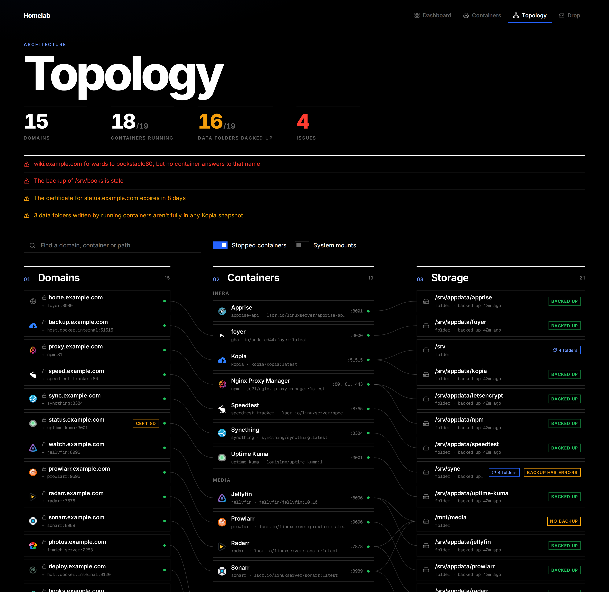
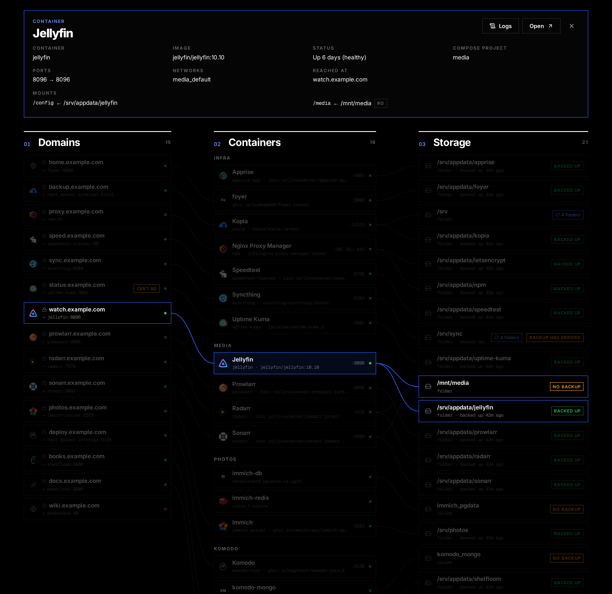
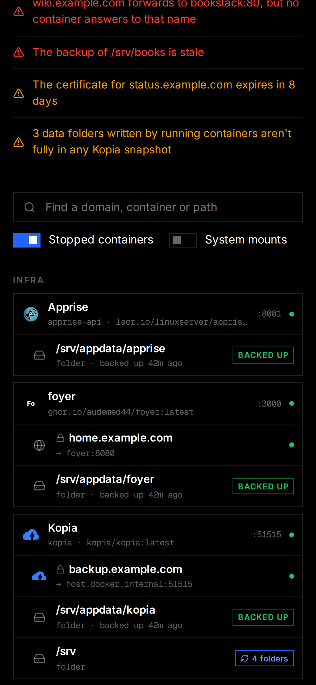

# Topology

The **Topology** page draws how your homelab fits together, in three
columns:

1. **Domains**: every proxy host in Nginx Proxy Manager, with its
   certificate.
2. **Containers**, grouped by compose project.
3. **Storage**: the folders and volumes each container mounts, marked with
   whether a Kopia snapshot covers them and which Syncthing folder they're
   in.

It needs the Docker socket; the [Nginx Proxy Manager](widgets.md#nginx-proxy-manager),
[Kopia](widgets.md#kopia) and [Syncthing](widgets.md#syncthing) widgets each
add their layer, and the page says which ones are missing.

## Reading the map

Hover or click anything to highlight its chain: a domain lights up the
container behind it and that container's storage; a folder lights up
everything that uses it. Clicking opens the details: image, status, ports,
networks, where it's reachable and each mount (with read-only ones marked),
plus buttons for its logs and its page.

Search finds a domain, container or path and keeps its neighbours in view.
Stopped containers and system mounts (`/etc/localtime`, the Docker socket)
can be shown or hidden.

## How things are matched

- A proxy host's forward address is matched to a container by **container
  name**, **compose service** or **network alias**.
- One that forwards to `host.docker.internal` or an IP is matched to the
  container that **publishes that port**; if none does, it's shown as
  running on **this host** (Cockpit, code-server and the like).
- **Kopia** reports its snapshot paths as the Kopia container sees them
  (`/data/appdata`). Foyer translates them through the Kopia container's own
  mounts (`/srv → /data`) into host paths, and marks every folder inside a
  snapshot as backed up, folders that contain a snapshot as partly backed
  up, and the rest as not backed up. **Syncthing** folders are translated
  the same way.
- A dashboard service's name and icon are used for its container and
  domain.

## Issues

The page lists problems at the top:

- a domain that forwards to a stopped container, or to a name no container
  answers to
- a certificate close to expiry, or nginx rejecting a host's config
- a stale or never-run backup
- data that running containers write to, but no snapshot fully covers

## On a phone

Narrow screens get a stacked list instead of the map: each container with
the domains that reach it and the storage it uses.
