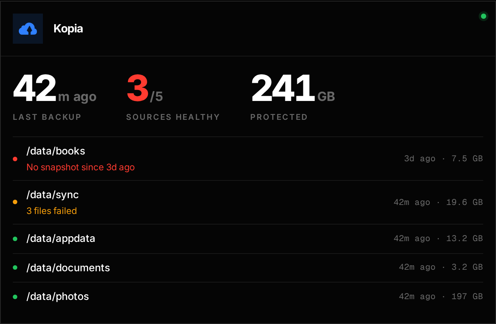
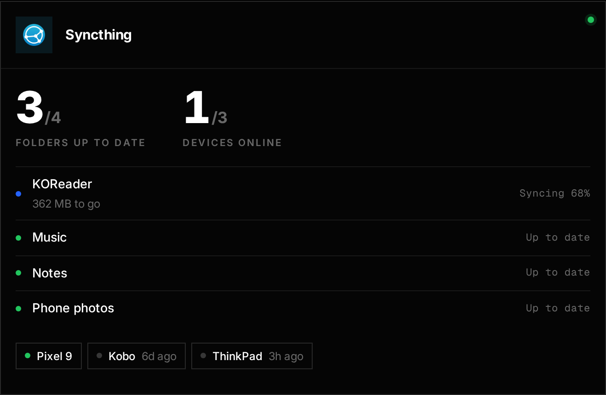
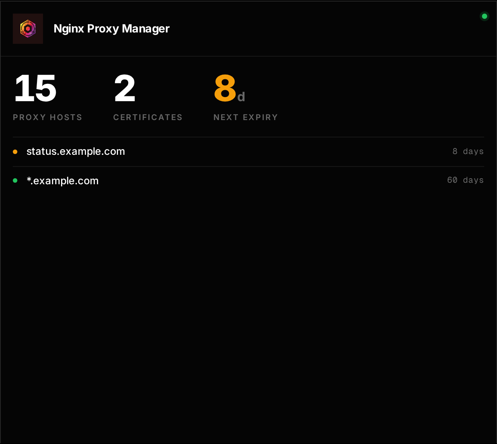
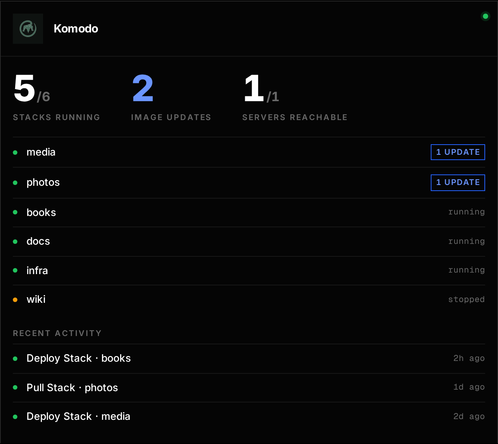
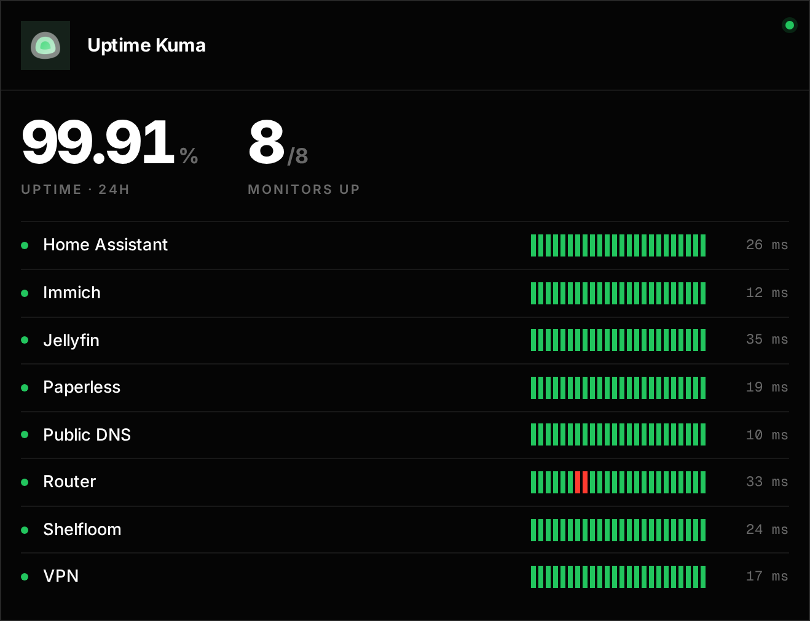
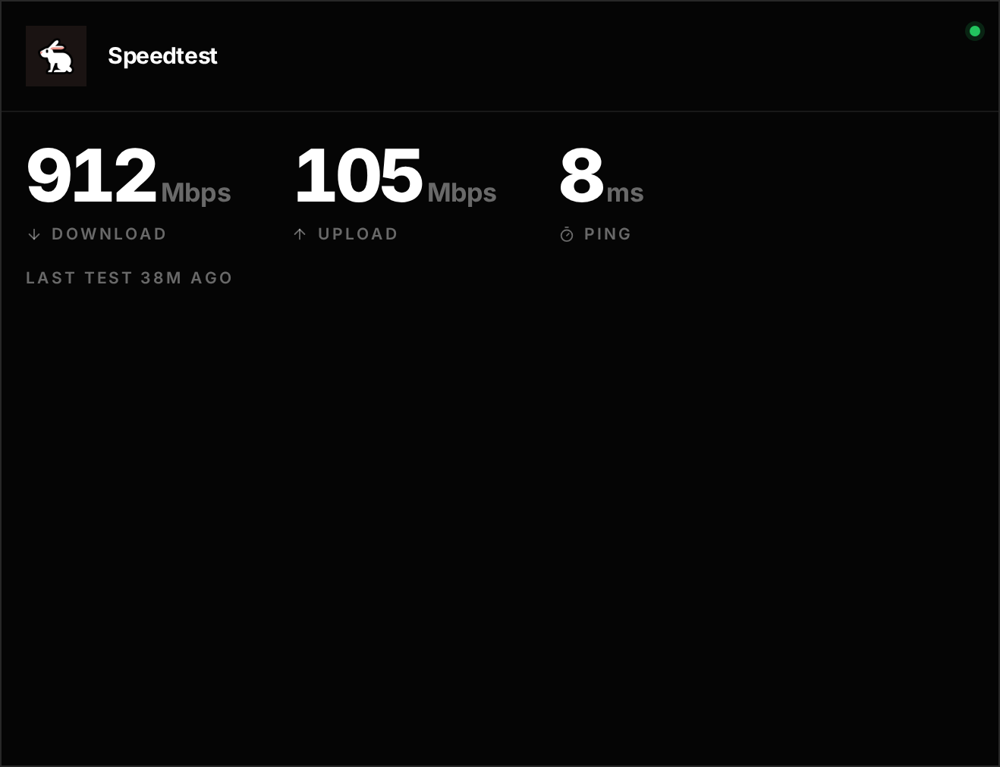
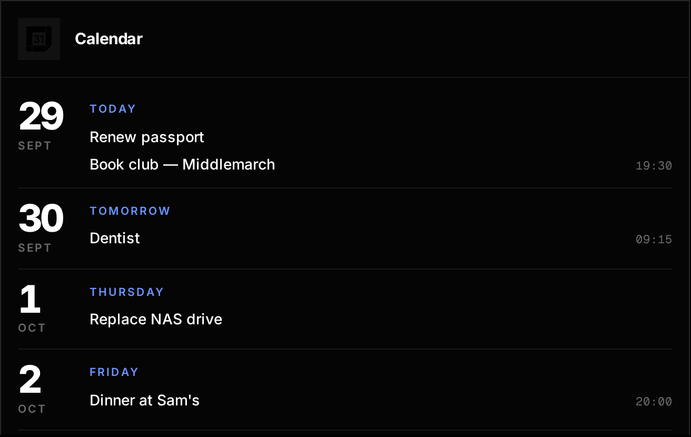

# Widgets

A widget turns a service card into a live panel. Add one in edit mode (click
a service → **Widget**) or under the service in `foyer.yaml`:

```yaml
      - name: Kopia
        url: https://backup.example.com
        icon: kopia.png
        container: kopia
        widget:
          type: kopia
          url: http://host.docker.internal:51515
          username: admin
          password: ${KOPIA_SERVER_PASSWORD}
          span: 2
```

Foyer fetches widget data on the server, so the URLs and credentials here
never reach the browser, and the addresses are the ones the Foyer
*container* can reach: a container name on the same Docker network
(`http://syncthing:8384`), or `host.docker.internal` for ports published by
other stacks (add `extra_hosts: ["host.docker.internal:host-gateway"]` to
Foyer's compose service).

Every widget takes `span`, the number of grid columns the card covers
(default 2). Data refreshes every minute and is cached for 45 seconds.

**Secrets.** In edit mode, keys and passwords are masked and kept unless you
type a new value. To keep them out of `foyer.yaml` entirely, write
`${VARIABLE}` and pass the variable to Foyer's container.

| Widget | Type | Shows |
|---|---|---|
| [App (Foyer widget format)](#app-widgets) | `app` | Whatever the app describes |
| [Keep](#keep) | `keep` | Keep's card with Run now; its sources feed the map and alerts |
| [Kopia](#kopia) | `kopia` | Backup freshness per snapshot source |
| [Syncthing](#syncthing) | `syncthing` | Folder sync state, devices online |
| [Nginx Proxy Manager](#nginx-proxy-manager) | `npm` | Proxy hosts, certificate expiry |
| [Komodo](#komodo) | `komodo` | Stacks, image updates, deploys |
| [Uptime Kuma](#uptime-kuma) | `uptimekuma` | A status page's monitors |
| [Speedtest Tracker](#speedtest-tracker) | `speedtest` | The latest result |
| [Calendar](#calendar) | `calendar` | Upcoming events from an iCal feed |

## App widgets


Any app can describe its own card in the [Foyer widget format](app-widgets.md):
figures, progress bars and a row of covers or a list. Shelfloom serves one.

| Setting | |
|---|---|
| `url` | The app's widget endpoint, e.g. `http://shelfloom:8000/api/foyer/widget` |
| `key` | Optional bearer token |

You rarely type this: in edit mode Foyer checks the apps on your dashboard
for `/api/foyer/widget` and offers to add the widget.

## Keep

[Keep](https://github.com/audemed44/keep) runs the homelab's backups (with
Kopia doing the storage). Its widget is Keep's own card, with the last run,
sources backed up, repository size, next run and a **Run now** button. Keep
also tells Foyer every source as a host path or Docker volume, so the
[topology map](topology.md) and the backup [alerts](alerts.md) use Keep
instead of Kopia when both are set up.

| Setting | |
|---|---|
| `url` | Keep's address, e.g. `http://keep:8080` |
| `key` | `KEEP_TOKEN` |

## Kopia



When each snapshot source was last backed up, and how big it is. Sources are
flagged when they're **stale** (no snapshot within `stale_hours`, or a
scheduled one more than an hour late), have **never** been backed up, or
their last snapshot **skipped files**.

| Setting | |
|---|---|
| `url` | The address of `kopia server start`, e.g. `http://host.docker.internal:51515` |
| `username` | The server's `--server-username` |
| `password` | The server's `--server-password` |
| `stale_hours` | Default `48` |

Foyer reads the same API as Kopia's web UI, so the server's own login is all
it needs. The [topology page](topology.md) uses this widget to show which
folders are backed up.

## Syncthing



Each folder's state (up to date, syncing with progress, errors) and which
devices are online, with when the others were last seen.

| Setting | |
|---|---|
| `url` | The GUI address, e.g. `http://syncthing:8384` |
| `key` | The API key: Syncthing → *Actions → Settings → General* |

## Nginx Proxy Manager



Proxy hosts and certificates, soonest expiry first. Hosts whose nginx
config was rejected are listed first.

| Setting | |
|---|---|
| `url` | The admin port, e.g. `http://npm:81` |
| `email`, `password` | An NPM user |
| `warn_days` | Certificates closer than this to expiry are flagged. Default `14`. |

A read-only user is enough: in NPM, **Users → Add User**, not an
administrator, with *Item Visibility: All Items* and *View Only* for Proxy
Hosts, Redirection Hosts, Streams and SSL Certificates.

This widget also powers the domain column of the [topology page](topology.md)
and gives [discovery](dashboard.md#discovery) real links for new containers.

## Komodo



Stacks (problems first), image updates Komodo has found, servers, and
recent deploys.

| Setting | |
|---|---|
| `url` | Komodo Core, e.g. `http://host.docker.internal:9120` |
| `key`, `secret` | An API key |

Use a read-only service user rather than your own account: in Komodo,
**Settings → Users → New Service User** (e.g. `foyer`), give it **Read** on
Stack, Server and Deployment, then create an API key on its page. The secret
is shown once.

## Uptime Kuma



The monitors on a public status page, down ones first, with recent
heartbeats and 24-hour uptime.

| Setting | |
|---|---|
| `url` | e.g. `http://uptime-kuma:3001` |
| `slug` | The status page's slug |

## Speedtest Tracker



| Setting | |
|---|---|
| `url` | e.g. `http://speedtest-tracker:80` |
| `key` | API token (Speedtest Tracker 1.x and later) |
| `version` | `2` (default) for Speedtest Tracker 1.x+, `1` for older releases |

## Calendar



Upcoming events from any iCal feed (Nextcloud, Google's secret address,
Home Assistant…), including all-day and simple recurring events.

| Setting | |
|---|---|
| `url` | The `.ics` address |
| `days` | How far ahead to look. Default `30`. |
| `max_events` | Default `8` |

Times are shown in the server's `TZ`.
